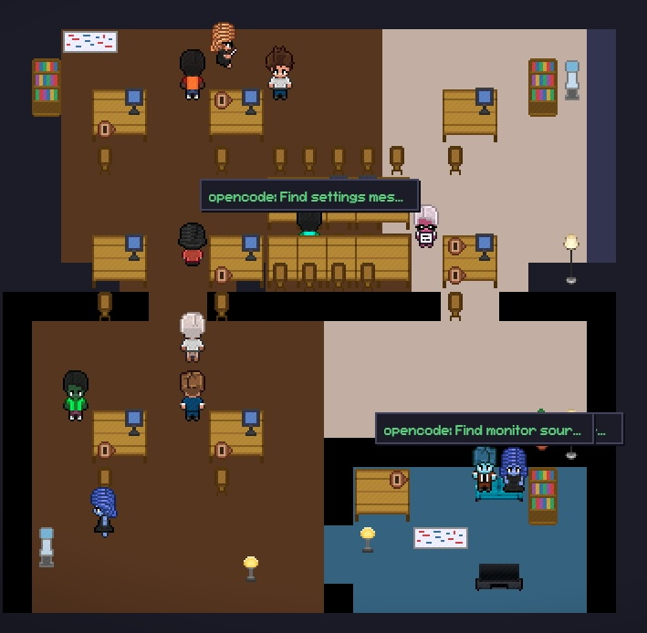

# Pixel Agents Desktop

This repository is **modified from** [pablodelucca/pixel-agents](https://github.com/pablodelucca/pixel-agents).

## Main Difference From Upstream

The original project is primarily a **VS Code extension**. This fork is built first as a **Tauri desktop app** (with the same pixel-office UI), so you can run it outside VS Code.

In short:

- Upstream: VS Code extension-first
- This fork: Tauri desktop-first (VS Code integration still exists)

Pixel Agents turns AI coding workers into animated pixel-art characters in a virtual office. Each worker is represented by a character that can walk, sit, type, read, and wait based on live activity.



## What's In This Fork

- Agent character visualization in a shared pixel office
- Live tool/activity animations (typing, reading, running, waiting)
- Sub-agent visualization for task tool workflows (clustered near parent agents for "discussion" behavior)
- Office layout editor (floors, walls, furniture, paint, pick, erase, undo/redo)
- Persistent layout storage and import/export support
- ClaudeCode/OpenCode/Codex monitor dashboard with status, events, and repo context
- Picture-in-Picture mode (always-on-top mini window that auto-follows active agents)
- Dismissible monitor notifications (manual `x` close + auto-timeout)
- Demo Mode toggle (forces active visuals + synthetic sub-agent discussion clusters)
- Git/PR status monitoring for tracked repos (`git`/`gh` available)
- Optional desktop runtime via Tauri

## Requirements

- VS Code 1.109.0+
- Node.js + npm
- Claude Code CLI installed/configured

Optional (for monitor features):

- OpenCode data directory (default `~/.local/share/opencode`)
- Codex data directory (default `~/.codex/sessions`)
- `git` CLI
- `gh` CLI authenticated

Optional (for desktop build):

- Rust toolchain (`cargo`, `rustc`) via `rustup`

Desktop build prerequisites (recommended):

1. Install Rust with rustup (official):

```bash
curl --proto '=https' --tlsv1.2 -sSf https://sh.rustup.rs | sh
```

After install, restart terminal and verify:

```bash
rustup --version
rustc --version
cargo --version
```

2. Platform-native build tools:

- macOS: install Xcode Command Line Tools

```bash
xcode-select --install
```

- Windows: install **Microsoft C++ Build Tools** (MSVC) from Visual Studio installer
- Linux: install GTK/WebKit dependencies required by Tauri (see Tauri prerequisites doc)

Official links:

- Rust install: https://www.rust-lang.org/tools/install
- rustup book: https://rust-lang.github.io/rustup/
- Tauri prerequisites: https://tauri.app/start/prerequisites/

Common install troubleshooting:

- `cargo` or `rustc` command not found:
  - Restart terminal, then run:

```bash
source "$HOME/.cargo/env"
```

- Shell still cannot find Rust tools:
  - Check PATH contains `$HOME/.cargo/bin`:

```bash
echo "$PATH"
```

- Old/broken toolchain state:

```bash
rustup update
rustup default stable
```

- Apple Silicon macOS target mismatch (rare):

```bash
rustup target add aarch64-apple-darwin
```

- TLS/certificate/network issues while downloading crates:
  - Verify your system clock is correct.
  - If you are behind a corporate proxy, configure `HTTPS_PROXY`/`HTTP_PROXY` for Cargo.
  - Check Cargo network config docs: https://doc.rust-lang.org/cargo/reference/config.html

## Quick Start

```bash
npm install
cd webview-ui && npm install && cd ..
npm run build
```

Then press `F5` in VS Code to launch Extension Development Host.

## Usage

1. Open the **Pixel Agents** panel.
2. Click **+ Agent** to launch a worker terminal + character.
3. Watch characters react to actual tool activity.
4. Click **Layout** to edit your office.
5. (Optional) Open **Settings** to configure monitor sources (ClaudeCode/OpenCode/Codex) and polling.
6. Toggle **PiP** (bottom-right) to switch to always-on-top mini mode while you work in other apps.
7. Toggle **Demo Mode** in **Settings** to simulate a fully busy office for screenshots/demos.

## Monitor Dashboard

The monitor view can aggregate local ClaudeCode/OpenCode/Codex sessions and show:

- State summaries (active, waiting, done, error)
- Session metadata and recent activity
- Repo path, branch/dirty state, and PR status (when available)
- Quick actions (open repo, copy session/resume, reveal terminal)
- Top-right notifications with manual dismiss (`x`) or auto-timeout
- Ingestion is capped to the latest 20 sessions/files to keep CPU usage predictable on large histories

## Picture-in-Picture Mode

- Use the **PiP** toggle at the bottom-right corner to enter mini-window mode.
- Desktop window becomes always-on-top and shrinks to a compact size.
- Camera auto-follows the currently active agent so you can monitor progress at a glance.
- PiP view hides monitor dashboard/toast overlays to keep focus on character activity.

## Demo Mode

- Enable **Demo Mode** from **Settings** to force all primary agents into active state.
- Agent overlays/status cards show rotating demo work items (strategy/ops-style placeholder tasks).
- Demo also spawns synthetic sub-agents near parent agents to create visible "discussion" groups.
- Turning Demo Mode off removes synthetic discussion sub-agents and restores normal live status behavior.

## Layout Editor Highlights

- Paint floors and walls
- Place/move/rotate/toggle furniture
- Eyedropper and furniture pick tools
- Drag/erase workflows
- Undo/redo stack
- Save/reset + import/export layout JSON
- Default-layout migration can normalize legacy center partitions and open the top half into a single larger room

## Asset Paths

- Character sprites: `webview-ui/public/assets/characters/char_0.png` to `char_5.png`
- Furniture sprites + catalog: `webview-ui/public/assets/furniture/`
- Build output mirrors assets into `dist/assets/` and `dist/webview/assets/`

## Desktop (Tauri)

Run desktop dev mode:

```bash
npm run desktop:dev
```

Build desktop app:

```bash
npm run desktop:build
```

## Tech Stack

- Extension: TypeScript, VS Code Webview API, esbuild
- Webview: React, TypeScript, Vite, Canvas 2D
- Desktop: Tauri (optional)

## Attribution

This project is based on and modified from the original Pixel Agents project:

- Upstream: https://github.com/pablodelucca/pixel-agents

## License

MIT License. See `LICENSE`.
